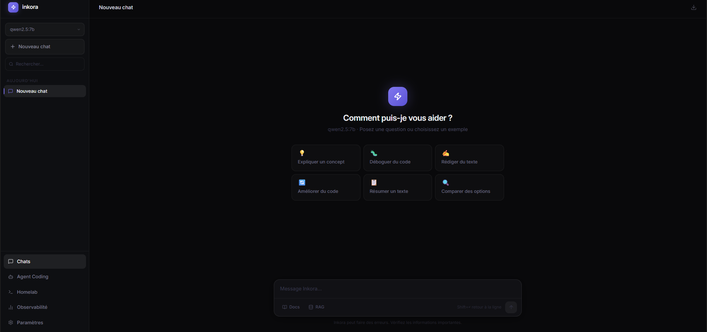
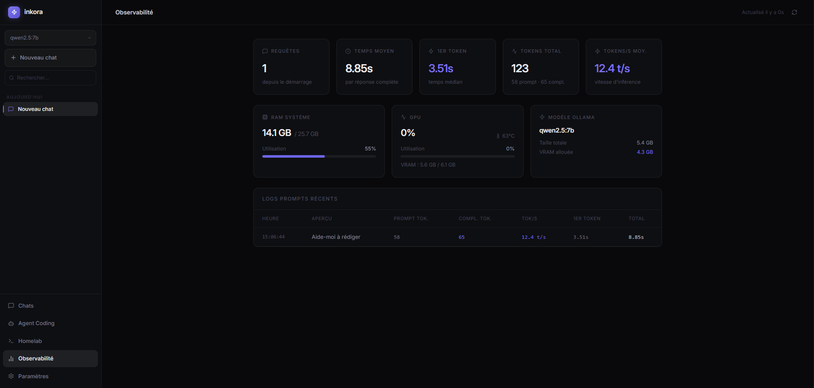

# Inkora AI

Interface de chat IA locale, 100% privée, propulsée par [Ollama](https://ollama.com). Zéro API externe, zéro tracking — tout tourne sur ta machine.

## Aperçu

| Chat — welcome screen | Dashboard d'observabilité |
|---|---|
|  |  |

## Fonctionnalités

- **Chat streamé** — conversations avec n'importe quel modèle Ollama, arrêt à la volée
- **RAG local** — indexe tes fichiers et injecte du contexte pertinent via `nomic-embed-text`
- **Agent Coding** — explore et modifie ton code de façon autonome (boucle ReAct avec 9 outils)
- **Agent Homelab** — gère ton infrastructure Docker, appelle tes services internes (Home Assistant…), diagnostique les conteneurs en panne
- **Analyse AST** — l'agent comprend la structure réelle du code : symboles, définitions, exports
- **Sélecteur de modèle** — switche entre qwen, mistral, llama… directement depuis la sidebar
- **System prompt** — personnalise le comportement du modèle pour toutes les conversations
- **Export** — télécharge une conversation en JSON ou Markdown
- **Dashboard d'observabilité** — tokens/s, TTFT, RAM, GPU (nvidia-smi), historique des runs agent
- **Persistance serveur** — conversations et embeddings RAG survivent aux redémarrages
- **Auto-titrage** — le titre d'une conversation est généré automatiquement après le premier échange
- **Logs structurés** — pino avec pretty-print en dev, JSON en production
- **UI Open WebUI-style** — welcome screen, bulles différenciées, input intégré, sidebar groupée par date, titre éditable inline, settings en sidebar

## Stack

| Couche | Technologie |
|--------|-------------|
| Frontend | React 19, Vite, Tailwind CSS v4, react-router-dom v7 |
| Backend | Express 5, Node.js 18+, tsx |
| IA | Ollama (local) |
| AST | @typescript-eslint/typescript-estree |
| Logs | pino + pino-pretty |
| Tests | vitest |
| Monorepo | npm workspaces (`@inkora/web`, `@inkora/server`, `@inkora/shared`) |

## Prérequis

- **Node.js** ≥ 18
- **Ollama** — [ollama.com/download](https://ollama.com/download)

```bash
ollama pull qwen2.5:7b           # chat généraliste (défaut)
ollama pull qwen2.5-coder:7b     # agent coding (recommandé)
ollama pull nomic-embed-text     # embeddings RAG
```

## Installation

```bash
git clone <repo>
cd inkora-ai
npm install
```

## Configuration

Copie `.env.example` en `.env` à la racine :

```bash
cp .env.example .env
```

```env
PORT=3001
OLLAMA_URL=http://localhost:11434
OLLAMA_MODEL=qwen2.5:7b
WEB_ORIGIN=http://localhost:5173

# Agent Homelab
AUTOMATION_MODEL=                         # vide = utilise OLLAMA_MODEL
AUTOMATION_ALLOWED_CONTAINERS=nginx,postgres,homeassistant  # whitelist restart/stop/start
AUTOMATION_ALLOWED_HOSTS=localhost,127.0.0.1,homeassistant.local  # whitelist http_request
```

**`apps/web/.env`** (optionnel si tu utilises l'URL par défaut)

```env
VITE_API_URL=http://localhost:3001
```

## Lancement

```bash
# Terminal 1
npm run dev -w @inkora/server

# Terminal 2
npm run dev -w @inkora/web
```

Ouvre http://localhost:5173

## Tests

```bash
npm test -w @inkora/server
```

---

## Architecture

```
inkora-ai/
├── .env.example
├── data/                               # Créé automatiquement (gitignored)
│   ├── conversations.json              # Persistance conversations
│   └── rag-store.json                  # Persistance embeddings RAG
├── shared/
│   └── types/index.ts                  # @inkora/shared — types communs
├── server/src/
│   ├── index.ts                        # Express + toutes les routes
│   ├── agent-core.ts                   # Moteur ReAct partagé (streamOllama + boucle ReAct)
│   ├── agent.ts                        # Coding agent — 9 outils (fichiers, git, shell, AST, RAG)
│   ├── agent-automation.ts             # Homelab agent — Docker, http_request, system_info
│   ├── ast.ts                          # Analyse AST TypeScript/JS + find definition
│   ├── bus.ts                          # Event bus typé + historique runs agent
│   ├── context.ts                      # Sliding window contexte (≤ 6 000 tokens)
│   ├── conversations.ts                # CRUD conversations + persistance JSON
│   ├── rag.ts                          # Vector store + embeddings + persistance JSON
│   ├── logger.ts                       # Pino — child loggers par module
│   └── __tests__/                      # Vitest — 22 tests
└── apps/web/src/
    ├── pages/
    │   ├── ChatPage.tsx                # Chat + RAG toggle + auto-titre + warning contexte
    │   ├── AgentPage.tsx               # Coding agent — streaming + TOOL_META (9 outils)
    │   ├── AutomationPage.tsx          # Homelab agent — Docker + HTTP
    │   └── DashboardPage.tsx           # Observabilité (pause si onglet masqué)
    ├── components/
    │   ├── Sidebar.tsx                 # Nav + sélecteur modèle + recherche + groupement par date
    │   ├── ChatMessage.tsx             # Bulles user/assistant différenciées + actions hover
    │   ├── ChatInput.tsx               # Carte avec RAG toggle + Docs intégrés
    │   ├── DocumentPanel.tsx           # Upload / gestion RAG
    │   └── SettingsModal.tsx           # Overlay large avec sidebar de navigation (780×680px)
    └── lib/
        ├── config.ts                   # API_URL — source unique
        ├── api.ts                      # /api/chat + /api/title + /api/conversations
        ├── agent.ts                    # /api/agent/run + idle timeout 60s
        ├── automation.ts               # /api/automation/run + idle timeout 60s
        ├── rag.ts                      # /api/rag/*
        ├── stats.ts                    # /api/metrics + /api/system
        └── storage.ts                  # localStorage (system prompt, modèle, RAG toggle)
```

## API

### Chat & Titrage

| Méthode | Route | Description |
|---------|-------|-------------|
| `GET` | `/health` | Statut + modèle actif |
| `GET` | `/api/info` | Config serveur |
| `GET` | `/api/ollama/health` | Modèles Ollama disponibles |
| `POST` | `/api/chat` | Chat streamé (texte brut) |
| `POST` | `/api/title` | Génère un titre court pour une conversation |

### Conversations

| Méthode | Route | Description |
|---------|-------|-------------|
| `GET` | `/api/conversations` | Liste toutes les conversations |
| `GET` | `/api/conversations/:id` | Récupère une conversation |
| `PUT` | `/api/conversations/:id` | Crée ou met à jour |
| `DELETE` | `/api/conversations/:id` | Supprime |
| `DELETE` | `/api/conversations` | Efface tout |

### Agent Coding

| Méthode | Route | Description |
|---------|-------|-------------|
| `POST` | `/api/agent/run` | Lance l'agent coding (NDJSON streamé) |
| `GET` | `/api/agent/runs` | Historique des 20 derniers runs |

### Agent Homelab

| Méthode | Route | Description |
|---------|-------|-------------|
| `POST` | `/api/automation/run` | Lance l'agent homelab (NDJSON streamé) |

### Système, Métriques & RAG

| Méthode | Route | Description |
|---------|-------|-------------|
| `GET` | `/api/system` | RAM, GPU, modèle Ollama chargé |
| `GET` | `/api/metrics` | Tokens, temps de réponse, logs récents |
| `GET` | `/api/rag/documents` | Documents indexés |
| `POST` | `/api/rag/upload` | Indexe un document `{ name, content }` |
| `DELETE` | `/api/rag/documents/:id` | Supprime un document |
| `DELETE` | `/api/rag/documents` | Vide le store RAG |

### Événements `/api/agent/run` et `/api/automation/run` (NDJSON)

```json
{ "type": "stream_chunk",  "chunk": "..." }
{ "type": "stream_commit", "as": "thought" | "answer", "text": "..." }
{ "type": "tool_call",     "name": "ast_symbols", "args": { "path": "..." } }
{ "type": "tool_result",   "name": "ast_symbols", "content": "...", "isError": false }
{ "type": "error",         "content": "..." }
{ "type": "done" }
```

## Agent Coding — mode d'emploi

1. Va sur **/agent** dans la sidebar
2. Décris une tâche (ou clique sur un exemple)
3. Renseigne le **répertoire de travail**
4. `Ctrl+Entrée` ou **Lancer**

**Outils disponibles (9)**

| Outil | Description | Sécurité |
|-------|-------------|----------|
| `read_file(path)` | Lit un fichier (200 lignes max) | — |
| `write_file(path, content)` | Écrit ou modifie un fichier | Bloque chemins système et fichiers sensibles |
| `list_dir(path)` | Liste un répertoire | Exclut node_modules, .git, symlinks |
| `search_code(pattern, dir?)` | Recherche regex dans les sources | — |
| `ast_symbols(path)` | Symboles d'un fichier (fonctions, classes, types…) avec numéros de ligne | — |
| `ast_find_symbol(name, dir?)` | Localise la définition d'un symbole dans le projet | — |
| `rag_search(query)` | Recherche sémantique dans les documents RAG | — |
| `git_run(args)` | Commandes git | Whitelist sous-commandes, bloque `--force`, `--hard` |
| `shell_run(cmd)` | Commandes shell | Whitelist + patterns bloqués |

> `qwen2.5-coder:7b` donne de bien meilleurs résultats que les modèles généralistes.

**Sécurité agent**

- `write_file` : bloque `/etc`, `/sys`, `/bin`, `~/.ssh`, `~/.bashrc`, etc.
- `git_run` : sous-commandes autorisées uniquement (status, log, diff, add, commit, branch…)
- `shell_run` : whitelist de commandes + patterns bloqués (`rm -rf`, `sudo`, `dd`, `curl|bash`…)
- Détection de boucle : si le même outil est appelé 3× avec les mêmes arguments → arrêt automatique
- Cross-platform : `cmd.exe` sur Windows, `/bin/bash` sur Linux/macOS

## Agent Homelab — mode d'emploi

1. Va sur **Homelab** dans la sidebar
2. Décris une tâche (ou clique sur un exemple)
3. `Ctrl+Entrée` ou **Lancer**

**Outils disponibles (9)**

| Outil | Description | Sécurité |
|-------|-------------|----------|
| `docker_ps()` | Liste tous les conteneurs (état, image, ports) | Lecture seule |
| `docker_logs(container, lines?)` | Dernières N lignes de logs d'un conteneur | Lecture seule |
| `docker_stats()` | CPU / mémoire / réseau de tous les conteneurs actifs | Lecture seule |
| `docker_inspect(target)` | Config, volumes, variables d'env, réseau | Lecture seule |
| `docker_restart(container)` | Redémarre un conteneur | Whitelist `AUTOMATION_ALLOWED_CONTAINERS` |
| `docker_stop(container)` | Arrête un conteneur | Whitelist `AUTOMATION_ALLOWED_CONTAINERS` |
| `docker_start(container)` | Démarre un conteneur arrêté | Whitelist `AUTOMATION_ALLOWED_CONTAINERS` |
| `http_request(method, url, headers?, body?)` | GET/POST vers services internes (Home Assistant, webhooks…) | Whitelist `AUTOMATION_ALLOWED_HOSTS` |
| `system_info(command)` | Infos système : `df`, `free`, `ps`, `uptime`, `uname` | Commandes fixes |

**Sécurité**

- Opérations mutantes Docker (`restart`, `stop`, `start`) bloquées tant que `AUTOMATION_ALLOWED_CONTAINERS` est vide — remplis cette variable avant d'activer le contrôle des conteneurs
- `http_request` limité aux hôtes de `AUTOMATION_ALLOWED_HOSTS` (défaut : `localhost,127.0.0.1`)
- Nom de conteneur validé par regex (`[a-zA-Z0-9_.\-]+`) pour éviter l'injection de commandes
- Détection de boucle identique à l'agent coding (3 appels identiques → arrêt automatique)

**Configuration Home Assistant**

```env
AUTOMATION_ALLOWED_HOSTS=localhost,127.0.0.1,homeassistant.local,192.168.1.10
```

Exemple de tâche : *"Appelle l'API Home Assistant sur http://homeassistant.local:8123/api/states avec le token Bearer et liste tous les capteurs de température."*

## RAG — mode d'emploi

1. Dans le chat, clique sur **Docs** dans la barre d'input (en bas)
2. Glisse ou sélectionne des fichiers (max 1.5 MB)
3. Active le toggle **RAG** dans la barre d'input — les 5 chunks les plus proches sont injectés
4. Les embeddings survivent au redémarrage (`data/rag-store.json`)

Formats : `.txt .md .ts .tsx .js .jsx .py .go .rs .json .yaml .toml .html .css .sql .sh`

## Interface

### Chat — zone de saisie

La barre d'input est une carte à deux zones :

- **Haut** : textarea auto-resize (jusqu'à 200px)
- **Bas** : bouton `Docs` pour gérer les documents RAG + bouton `RAG` avec indicateur actif (point violet) · bouton Envoyer/Stop à droite

### Chat — welcome screen

Quand une conversation est vide, la page affiche un écran d'accueil centré : logo Inkora, titre "Comment puis-je vous aider ?" et une grille de 6 suggestions cliquables qui soumettent directement la requête.

### Chat — messages

- **Messages user** : bulles alignées à droite, fond `#1A1830` avec bordure violette discrète
- **Messages assistant** : icône Sparkles à gauche, texte pleine largeur avec rendu Markdown complet
- **Actions au hover** : Copier, Régénérer (assistant) / Modifier (user) — visibles uniquement au survol
- **Titre de conversation** : cliquable dans le header pour renommage inline (Entrée pour valider, Échap pour annuler)

### Sidebar

- **Recherche** : champ filtrant en temps réel avec croix d'effacement
- **Groupement par date** : `Aujourd'hui` / `Hier` / `7 derniers jours` / `Plus ancien`
- **Navigation** : Chats · Agent Coding · Homelab · Observabilité

### Paramètres

L'overlay Settings est redessiné en modal large (780 × 680px) avec une **sidebar de navigation gauche** :

| Section | Contenu |
|---------|---------|
| **Assistant** | System prompt (textarea 4000 car.) + Réinitialiser + Enregistrer |
| **Données** | Stockage localStorage, conversations, store RAG (vider avec confirmation) |
| **Serveur** | Version, URL backend, statut Ollama, liste des modèles disponibles |

La structure est prévue pour accueillir de nouvelles sections (Apparence, Agents, Raccourcis…) sans refactoring.

## Roadmap

- [x] Agent coding avec outils write/execute (sécurité whitelist)
- [x] Persistance RAG et conversations sur disque
- [x] Auto-titrage des conversations
- [x] Logs structurés (pino)
- [x] Crash recovery agent (timeouts, idle detection)
- [x] Sliding window contexte côté serveur
- [x] Analyse AST TypeScript/JS (symboles + find definition)
- [x] Event bus typé + historique runs agent
- [x] Suite de tests vitest (22 tests)
- [x] Agent Homelab — Docker (ps/logs/stats/inspect/restart) + http_request interne
- [x] UI Open WebUI-style — welcome screen, input card, sidebar groupée, titre inline, settings sidebar
- [ ] Agent Homelab — Home Assistant (automatisations, états, services)
- [ ] Agent Homelab — surveillance de services (alertes, healthchecks)
- [ ] Upload PDF
- [ ] Export dataset JSONL pour fine-tuning (`ollama create`)
- [ ] Serveur MCP — intégration Claude Code / tout client MCP
- [ ] Orchestration multi-agents
